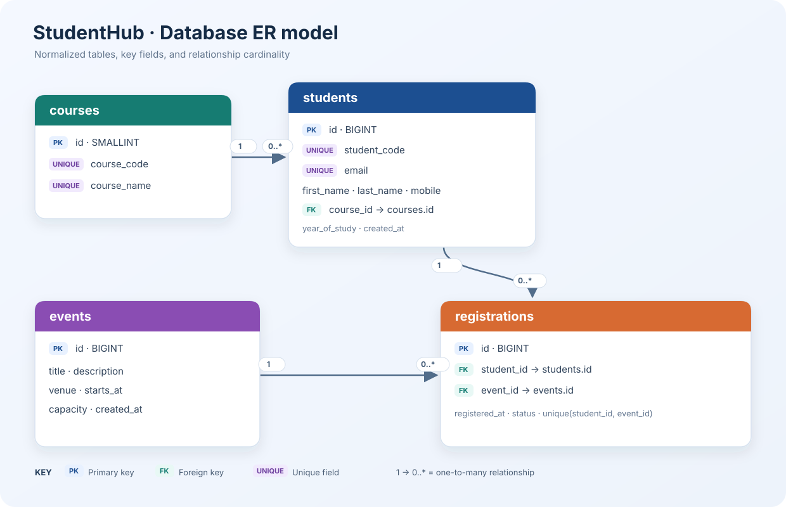

# Practical 8 — MySQL schema, ER model, and PDO

**Outcome:** create a normalized StudentHub schema for courses, students, events, and event registrations; connect to MySQL from PHP using PDO; and demonstrate parameterized queries. The files target MySQL 8+ or MariaDB 10.2+ and PHP 8+.

## Folder structure

- `database/schema.sql` creates the `studenthub` database and relational tables.
- `database/seed.sql` adds fictional course, student, event, and registration records.
- `docs/erd.svg` shows the primary keys, foreign keys, and relationship cardinalities.
- `config/db.php` creates a reusable PDO connection using environment variables.
- `pages/connection-test.php` reports a safe connection success or failure.
- `examples/prepared-statements.php` demonstrates parameterized SELECT and INSERT queries.

## Database design

`courses` is a lookup table referenced by `students`. Events and students have a many-to-many relationship, represented by `registrations`. Primary keys identify rows; foreign keys preserve referential integrity. Unique constraints prevent duplicate course codes, student identifiers/emails, and repeated registration of the same student for the same event. The student year and event capacity have database constraints.



## Setup with XAMPP or phpMyAdmin

1. Start MySQL in XAMPP and open phpMyAdmin.
2. Import `database/schema.sql`, then import `database/seed.sql` into the `studenthub` database. The sample values are fictional.
3. Create a dedicated local database account. In phpMyAdmin SQL, replace the password placeholder with a strong local password before running:

   ```sql
   CREATE USER 'studenthub_app'@'127.0.0.1' IDENTIFIED BY 'replace-with-a-strong-local-password';
   GRANT SELECT, INSERT, UPDATE, DELETE ON studenthub.* TO 'studenthub_app'@'127.0.0.1';
   FLUSH PRIVILEGES;
   ```

4. In a terminal, export the connection values. The password remains in your shell environment and is not stored in the repository:

   ```sh
   export STUDENTHUB_DB_HOST=127.0.0.1
   export STUDENTHUB_DB_PORT=3306
   export STUDENTHUB_DB_NAME=studenthub
   export STUDENTHUB_DB_USER=studenthub_app
   printf 'Database password: '
   read -s STUDENTHUB_DB_PASSWORD
   printf '\n'
   export STUDENTHUB_DB_PASSWORD
   ```

5. From this folder, start a local PHP server and open the connection page:

   ```sh
   php -S 127.0.0.1:8001 -t .
   ```

   Open `http://127.0.0.1:8001/pages/connection-test.php`.

## PDO and prepared statements

The PDO helper uses exception mode, associative fetches, `utf8mb4`, and native prepared statements (`PDO::ATTR_EMULATE_PREPARES` is disabled). `examples/prepared-statements.php` binds values separately from SQL text. Never concatenate submitted values into a query. The demo catches and logs detailed connection errors on the server while showing a generic message in the browser.

## Practical checklist

- [x] Normalized relational design for courses, students, events, and registrations.
- [x] Primary keys, foreign keys, uniqueness rules, indexes, and field constraints.
- [x] Fictional seed data for students, events, and registrations.
- [x] Reusable PDO connection with credentials read from the environment.
- [x] Connection status page and prepared-statement examples.
- [ ] Capture the successful connection-test page after MySQL is installed, configured, and running locally; include it in the report.

This computer has XAMPP with MariaDB 10.4 and PHP's `pdo_mysql` driver installed. The database service was stopped during setup, and starting it with XAMPP requires administrator access. Start **MySQL Database** in XAMPP Manager, then follow the setup steps above and capture the successful connection page for the report. Keep database passwords out of Git. No commit or push is performed by this project workflow.
